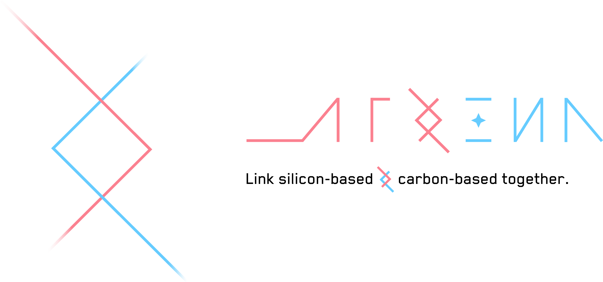

<div align="center">
  

[](https://www.npmjs.com/package/koishi-plugin-yesimbot)
[](LICENSE)


[](https://deepwiki.com/YesWeAreBot/YesImBot)

**机器壳，人类心。**
<br/>
_让 AI 更像人类，让聊天更有温度_
<br/>
[Features](#features) • [Architecture](#architecture) • [Quick Start](#quick-start) • [Plugins](#plugins) • [Community](#community)

</div>

---

**YesImBot** 是一套基于 Koishi 的群聊 AI 插件与运行时，让大语言模型以自然的方式融入你的群聊。

## Features

- **消息优先的运行时** — `@yesimbot/agent-runtime` 将"观察"与"发言"分离：普通消息进入频道历史，Will 决定等待或触发模型回合；忙时事件加入当前 turn，不创建第二个流消费者。
- **多模型即插即用** — 通过 provider 插件接入 OpenAI、Anthropic、DeepSeek、Google 等模型，并通过 `models.json` 管理模型注册与默认值。
- **强大的插件体系** — 工具、提示词、消息转换、生命周期钩子，每个维度都可扩展。插件按 `pre` / normal / `post` 顺序编排，互不干扰。
- **上下文持久化** — Core 为每个频道生成 26 字符 Channel Key，并把 Manifest、JSONL、assets、workspace 和插件 namespace 统一放在 `<basePath>/channels/<key>/`。运行时可加载 `AGENTS.md` 与 `PERSONA.md`。
- **平台输入边界** — 平台插件注册 `SessionResolver`，Gateway 在 Session 生命周期内完成解析、图片冻结和被动回复，再把 Session-free EventRecord 交给频道 Runtime。
- **丰富的能力插件** — 虚拟文件系统与 Bash 沙箱、MCP 客户端、Skill 加载、Web 搜索、MemOS Cloud 记忆、OneBot 工具、贴纸处理等。
- **Koishi 原生集成** — 作为 `koishi-plugin-yesimbot` 运行，复用 Koishi 生态的适配器、中间件和插件体系。

## Quick Start

YesImBot 作为 Koishi 插件运行，安装方式与普通 Koishi 插件一致：

```bash
# 使用 yarn（推荐）
yarn add koishi-plugin-yesimbot

# 或使用 npm
npm install koishi-plugin-yesimbot
```

然后在 Koishi 配置文件中启用插件，配置你偏好的模型 provider 即可开始使用。

> [!TIP]
> 想了解详细的配置与使用方式？请查阅[官方文档站](https://docs.yesimbot.chat/)。

## Plugins

YesImBot 的能力通过插件系统按需加载。

| 插件        | 包名                                     | 能力                                |
| ----------- | ---------------------------------------- | ----------------------------------- |
| 工作区      | `koishi-plugin-yesimbot-workspace`       | 文件操作、命令执行等工作区工具      |
| MCP 客户端  | `koishi-plugin-yesimbot-mcp-client`      | 通过 MCP 协议接入外部工具服务       |
| 技能        | `koishi-plugin-yesimbot-skills`          | 动态加载与执行预定义技能            |
| MemOS       | `koishi-plugin-yesimbot-memos-client`    | 接入 MemOS Cloud 长期记忆           |
| 搜索        | `koishi-plugin-yesimbot-search-service`  | 网络搜索与信息检索                  |
| OneBot 平台 | `koishi-plugin-yesimbot-platform-onebot` | OneBot 入站消息、图片准备与事件适配 |
| OneBot 工具 | `koishi-plugin-yesimbot-onebot-utils`    | OneBot 平台工具集成                 |
| 贴纸        | `koishi-plugin-yesimbot-sticker`         | 表情与贴纸处理                      |

### LLM Provider

| Provider  | 包名                                         |
| --------- | -------------------------------------------- |
| OpenAI    | `@yesimbot/koishi-plugin-provider-openai`    |
| Anthropic | `@yesimbot/koishi-plugin-provider-anthropic` |
| DeepSeek  | `@yesimbot/koishi-plugin-provider-deepseek`  |
| Google    | `@yesimbot/koishi-plugin-provider-google`    |

## Architecture

```text
Athena/
├── core/                     Koishi 主插件：Gateway、模型、频道存储与运行时
├── packages/agent-runtime/   通用消息运行时：回合队列、工具调用、插件钩子、状态与存储
├── platforms/                平台适配器：OneBot 入站消息与事件边界
├── providers/                模型 Provider 插件：OpenAI / Anthropic / DeepSeek / Google
├── plugins/                  可选能力插件：Workspace / MCP / Skill / Search / MemOS 等
├── docs/                     设计记录与归档文档
└── assets/                   项目资源（Logo 等）
```

## Development

本仓库使用 **Yarn 4** 与 **Turborepo** 管理。

```bash
yarn install
yarn check-types
yarn test
yarn build
```

包级验证使用 Turbo filter：

```bash
yarn turbo run test --filter=@yesimbot/agent-runtime
yarn turbo run check-types --filter=koishi-plugin-yesimbot
```

## Community

[](http://qm.qq.com/cgi-bin/qm/qr?_wv=1027&k=k3O5_1kNFJMERGxBOj1ci43jHvLvfru9&authKey=TkOxmhIa6kEQxULtJ0oMVU9FxoY2XNiA%2B7bQ4K%2FNx5%2F8C8ToakYZeDnQjL%2B31Rx%2B&noverify=0&group_code=857518324)
[](https://github.com/YesWeAreBot/YesImBot/issues)
[](https://docs.yesimbot.chat)

---

## Contributors

感谢所有为 YesImBot 付出努力的人：

[](https://github.com/YesWeAreBot/YesImBot/graphs/contributors)

## Star History

<div align="center">

<a href="https://www.star-history.com/?repos=YesWeAreBot%2FYesImBot&type=date&legend=top-left">
 <picture>
   <source media="(prefers-color-scheme: dark)" srcset="https://api.star-history.com/image?repos=YesWeAreBot/YesImBot&type=date&legend=top-left" />
   <source media="(prefers-color-scheme: light)" srcset="https://api.star-history.com/image?repos=YesWeAreBot/YesImBot&type=date&legend=top-left" />
   
 </picture>
</a>


</div>
